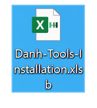

# About Project
This project is my VBA tool for my resume portfolio.

- [About Project](#about-project)
- [Download](#download)
  - 
- [Installation Instructions](#installation-instructions)
  - 
- [Release Features](#release-features)
  - [Auto Add-In](#auto-add-in)
  - [Sheet Controller](#sheet-controller)
  - [Chart Controller](#chart-controller)
  - [Pivot Controller](#pivot-controller)
  - [Files Controller](#files-controller)
  - [Range Controller](#range-controller)
  - [Picture Controller](#picture-controller)
  - [Network Controller](#network-controller)
  - [Shortcuts](#shortcuts)
- [Release Notes](#release-notes)
  - [v2.3.3 - 2023/10/01](#v233---20231001)
    - [Added](#added)
    - [Changed](#changed)
    - [Removed](#removed)
- [Incoming Feature](#incoming-feature)
    - [Network Controller](#network-controller-1)
    - [Shortcuts:](#shortcuts-1)
    - [Options](#options)
    - [Auto Add-In](#auto-add-in-1)
- [Contact](#contact)
- [Acknowledgments](#acknowledgments)
- [License](#license)
---
# Download
- Click here: 
  *[Danh-Tools-Installation.xlsb](https://github.com/Duc-Anh-Ho/VBA-projects/raw/main/Danh-Tools-Installation.xlsb)* 
  ##  
# Installation Instructions
1. Enable all macros and Trust access to the VBA project object model.
   ##   
2. Open file 
  *[Danh-Tools-Installation.xlsb](./Danh-Tools-Installation.xlsb)* 
  and it will be installed automatically.
1. ***IMPORTANT:*** DO NOT enable auto-sending function, as antivirus software (e.g., Kaspersky) may detect it as a virus and delete core MS-Excel files. Please turn off Windows Defender and antivirus before enabling.

# Release Features
## Auto Add-In
  - **Auto installation:** Auto install add-in by only open file *[Danh-Tools-Installation.xlsb](./Danh-Tools-Installation.xlsb)*
  - **Remove button:** Remove add-in by *Remove AddIn* button.
  - **Refesh button:** Clean cache, stored memory and restart hanging tools.
##  Sheet Controller
  - **Fast add sheets:**
  - **Fast list sheets:**
  - **Fast rename sheets:**
  - **Fast show/hide/veryhide sheets:**
## Chart Controller
  - **Fast Hide/Show Error Label:**
## Pivot Controller
  - **Auto SYNC:**
## Files Controller
  - **Import (all) files:**
  - **Export all files:**
## Range Controller
  - **Hide/show (all) page breaks:**
  - **Bold first line:**
  - **Invert color:**
  - **Highlight range:**
## Picture Controller
  - **Arrange Picure:**
  - **Auto Arrange**
  - **Auto Snipping**
## Network Controller
- **Export Wifi:** Saved Wi-Fi connection information to csv/txt/json files.
## Shortcuts
| Shortcuts | Features | Note |
|------------------|-------|--------------|
|Ctrl + Shift + C|Copy Format||
|Ctrl + Shift + V|Paste Format||
|Ctrl + Shift + Alt + V|Paste Value||
|Ctrl + Tab|Next Sheet||
|Ctrl + Shift + Tab|Previous Sheet||
|Ctrl + Shift + M|Shape Move and Size||
|Ctrl + Shift + Alt + M|Shape Don't Move and Size||
|Ctrl + Del|Delete Format||
|Ctrl + Shift + Del|Delete All||
|Shift + F12|Copy Worksheet Fullname||
# Release Notes
## v2.3.3 - 2023/10/01
### Added
- Shortcut for delete format only and delete all.
- Shortcut for copy fullname of active workbook.
### Changed
- Update Refresh Ribbon button will remove then add custom shortcuts back.
### Removed
- Display current mode in Excel's status bar due to bugs.
# Incoming Feature
### Network Controller
- **Ping show:**
- **Unlock wifi:** (Linux only).
- **Auto Email: *(Don't release)*** Automatically send user information via email (be cautious).
### Shortcuts:
- **Ctrl + M:** Shape move and don't size with cells (duplicate system shortcuts).
- **Add and remove shortcuts:**
### Options
- **Customize Undo and redo**
- **Customize user settings:**
### Auto Add-In
- **Auto Update:** Ask for updating and update information
- **Status Update:** Display status bar current mode (drawbacked)
# Contact
- Facebook: [fb.com/meo658](https://www.fb.com/meo658)
- Linkedin: [linkedin.com/in/meo658](https://www.linkedin.com/in/meo658)
- Github: [github.com/Duc-Anh-Ho](https://github.com/Duc-Anh-Ho)
- Email:
  1. meo658@yahoo.com
  2. hoducanh123@outlook.com
- Trello: [Link trello of this project](https://trello.com/b/vYOUmHMM/danh-tools-kanban)
# Acknowledgments
Author: D. Anh
# License
Copyright (c) 2022 DANH
